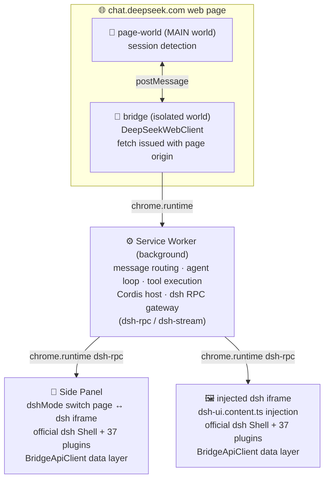

# dsh-in-web

> **dsh (DeepSeek Harness) inside your browser** · No local install, no extra quota

Turns [chat.deepseek.com](https://chat.deepseek.com) into a **dsh (DeepSeek Harness)**-shaped **Chrome MV3 extension**.

> **Core pitch**: zero local dsh installation. Session, models and conversations reuse the free web quota. The extension only does two things — embed the official dsh frontend and route the data layer through the page bridge.

> **中文版 中文**: [README.md](./README.md)

## ⚠️ Drawbacks of the web-proxy architecture (read this first)

The data plane is **not** the official API — it is a **bridge over chat.deepseek.com's private web endpoints** (a web reverse proxy). That architecture carries structural costs you should know before using it:

1. **Depends on unpublished web-only endpoints — no stability guarantee**
   The data plane talks to chat.deepseek.com's internal web APIs (`users/current`, `chat_session/create`, `chat/create_pow_challenge`, the `chat/completion` SSE stream, plus DeepSeekHashV1 proof-of-work). These endpoints have no docs, no versioning, no SLA. Any official change (paths, signatures, PoW parameters, response shapes) can **break the extension immediately**; fixing it requires reverse-engineering each time.

2. **Feature ceiling set by the web app**
   - **Models**: the web app exposes only chat models — the fuller model catalog and longer contexts available through the API are out of reach;
   - **Protocol**: the web SSE stream is a private protocol with **no native function calling** — agent tool calls cannot work natively; you must configure a third-party OpenAI-compatible provider to get real `tools`;
   - **Parameters**: temperature, thinking, reasoning-effort and other API params the web app does not expose are simply unavailable.

3. **Session state is welded to the web account**
   Every conversation rests on the chat.deepseek.com login cookie in the browser. Cookie expiry, remote sign-out, or manual logout → the extension's data plane **fails immediately**. The extension cannot manage credentials or refresh tokens on its own; it passively follows the web login state.

4. **The chat.deepseek.com page must be open**
   The LLM network layer (DeepSeekWebClient) lives in that page's content script — because a service-worker `fetch` cannot forge `Origin`/`Referer` (browser-forbidden headers) and the server would reject it. So **the page has to be open** to start a conversation; a side-panel-only workflow is limited by the page lifecycle.

5. **Rate-limit and account-risk exposure**
   Agent loops and tool-heavy turns generate high-frequency requests in a short window, which can trip the web app's risk controls (captcha, throttling, temporary bans). Quota/rates are shared with the web account; heavy use consumes the web quota.

6. **High ongoing maintenance**
   Each official frontend sync (`import-dsh`) must be re-patched for CSP (top-level `new Function` → stub); if the official bundle introduces new eval usage, the UI white-screens. Interface reverse-engineering is ongoing work, not a one-off.

7. **Structurally weak reliability**
   - The MV3 service worker is idle-recycled (~30 s), interrupting long-lived connections; after an extension reload/update, already-open pages throw `Extension context invalidated` (auto-recovery is built in, but the structural risk remains);
   - **No real backend**: no fixed egress IP, no server-side concurrency, no cross-device sync, cannot run outside the browser.

8. **Compliance boundary**
   Automated use of web endpoints may exceed DeepSeek's Terms of Service. **For personal learning and research only** — not for production or commercial use.

---

## 🚀 Features

- ✅ **Official dsh frontend embedded**: the full dsh Shell plus 37 client plugins (sessions / workspace / skills / prompts / models / agent presets / settings…), official artifacts untouched except for a minimal CSP-compat patch applied at sync time.
- 🎚️ **One-switch harness mode**: the Side Panel is always a settings page. Flip the switch and the chat.deepseek.com UI morphs into a fullscreen dsh harness instantly; flip it off to restore plain chat — live, no refresh needed.
- 🔌 **Bridge transport**: a custom `dsh-client-connection` bundle replaces the stock HTTP/WebSocket connection layer; RPC hops through `chrome.runtime` to the extension background, while data flows through the chat.deepseek.com web session.
- 🌐 **Web-page data channel**: the LLM network layer lives in a content script (isolated world) so fetches carry the page origin — `Origin`/`Cookie` come out naturally correct and the server accepts them.
- 🧠 **Agent capabilities**:
  - Agent presets (Standard / PTC / Minimal / Create) with persona injected into every message;
  - **Third-party OpenAI-compatible providers + native function calling**: once a provider is configured in the dsh model settings UI, agent tool calls actually execute (file editing / shell / retrieval / skills / subagents…), no longer degrading into chat; without one, it falls back to the web bridge.
- 🧱 **Native harness features kept**: streaming chat (thinking and text rendered separately), virtual workspace, skill library, prompt manager, terminal MVP, Cordis plugin kernel, workflows.

## 🏗️ Architecture

> In one line: the page's session, the extension's dsh frontend and a content-script network layer all meet at the Service Worker.



**Key design decisions**

- 🧱 **LLM network layer in a content script, not the SW**: a service-worker `fetch` cannot spoof `Origin`/`Referer` (browser-forbidden headers), so the server rejects it. Fetching from the content script automatically uses the page origin. (This is also the root cause of the "web-proxy" drawbacks above.)
- 🛡️ **CSP: top-level `new Function` → stub**: MV3 extension pages forbid `unsafe-eval`, but the official index bundle has a top-level `new Function` (the Cordis jsExpr evaluator), which crashes on load. `scripts/patch-dsh-web.mjs` swaps it for a safe stub; every plugin bundle is verified free of `__jsExpr`, so nothing is lost.
- 🔀 **Connection layer replaced by BridgeApiClient**: the stock `dsh-client-connection` targets a local harness over HTTP/WebSocket, a service that does not exist in a browser. The `scripts/dsh-bridge/` BridgeApiClient takes over: `doFetch` → `chrome.runtime.sendMessage({ kind: 'dsh-rpc' })`, streams → `chrome.runtime.connect({ name: 'dsh-stream' })`, and the background gateway forwards to the page bridge.
- ♻️ **Extension-context auto recovery**: after an MV3 extension reload/update, every `chrome.runtime` reference in already-open pages becomes invalid (`Extension context invalidated`). `scripts/dsh-bridge/context-recovery.ts` detects the error and throttled-reloads the host page to recover automatically.

## 🛠️ Development

```bash
pnpm install          # install deps (F: exFAT needs node-linker=hoisted)
pnpm dev              # WXT dev mode (HMR)
pnpm build            # build → .output/chrome-mv3
pnpm test             # full vitest suite (18 files / 152 tests)
pnpm compile          # tsc --noEmit type-check
pnpm check            # compile + test + build in one go
```

### Sync the official dsh frontend (optional)

`public/dsh-web/` is generated from a local deepseek-harness checkout; not committed to the repo.

```bash
node scripts/import-dsh.mjs                # sync official dist + client plugins + boot-manifest
node scripts/patch-dsh-web.mjs             # apply CSP-compat patch (import-dsh calls it too)
node scripts/build-connection-bridge.mjs   # rebuild the custom connection bridge bundle
node scripts/build-official-settings.mjs   # build official settings runtime (part of pnpm build)
```

### Manual load

1. `pnpm build`
2. Chrome → `chrome://extensions` → Developer mode → Load unpacked → select `.output/chrome-mv3`
3. Open chat.deepseek.com and sign in
4. Click the extension icon or press `Ctrl+Shift+Y` to open the side panel
5. Turn on **dsh mode** in the settings page → the chat UI morphs into the harness

### Configure a third-party OpenAI-compatible provider (optional, enables native function calling)

1. In dsh mode → Settings → **Models** → "Add custom provider"
2. Fill in route / Base URL / model / API key (the key is stored via `credentials` into `dsh-credentials`)
3. The session agent then runs on native function calling (tools really execute); without a provider it falls back to the web bridge automatically

### Debugging

For white screens or plugin load failures, open `chrome-extension://<extension-id>/debug.html` — it renders diagnostics directly (CSP probe / resource reachability / boot replay / RPC probe), no devtools needed. Common errors:

| Symptom | Fix |
|---|---|
| `new Function: BLOCKED` | CSP patch missing → re-run `node scripts/patch-dsh-web.mjs` |
| resource `404` | re-run `node scripts/import-dsh.mjs` to re-sync `public/dsh-web/` |
| `transport failure ... Extension context invalidated` | extension was reloaded — the page auto-recovers, or refresh once manually |
| RPC probe `THREW` | extension just reloaded → refresh the page; if still down, open the Service Worker from the extension details and read its console |

## ✅ Test coverage (18 files / 152 tests)

| Module | Files | Covered |
|---|---|---|
| bridge | `tests/bridge/*` (5) | PoW solving / SSE parsing / protocol construction / client streaming + retry / extension-context recovery |
| fs | `tests/fs/workspace.spec.ts` | virtual workspace read/write/edit, sandbox mode, path traversal guards |
| skills | `tests/skills/skill.spec.ts` | SKILL.md parsing / directory rendering / /name matching |
| prompts | `tests/prompts/prompt.spec.ts` | sections / interpolation / persona |
| agent | `tests/agent/*` (3) | tool-call parsing / agent-loop multi-turn refill / tool registry |
| plugin | `tests/plugin/*` (3) | Cordis kernel / browser host services / L0 loader |
| settings | `tests/settings/settings.spec.ts` | settings persistence / normalization |
| ui | `tests/ui/filetree.spec.ts` | file-tree building and filtering |
| terminal | `tests/terminal/shell.spec.ts` | whitelisted commands / injection rejection / quote parsing |
| agent-presets | `tests/agent-presets/persona.spec.ts` | preset persona injection / capability declaration |

## 🗺️ Milestones

- **Wave 0** skeleton + core four + baseline verification ✅
- **Wave 1** protocol layer + bridge runtime + chat UI ✅
- **Wave 2** virtual FS / skill library / prompts / agent primitives ✅
- **Wave 3** Cordis kernel / browser host / plugin loader / L1 design ✅
- **Wave 4** agent loop / Side Panel tabs / terminal MVP ✅
- **Wave 5** engineering (README / final self-check) ✅
- **Embedding dsh** official frontend + bridge transport + CSP patch + mode switch ✅
- **Agent layer** persona injection + tool-call echo + agent preset config ✅
- **Third-party providers** OpenAI-compatible + native function calling + extension-context auto recovery ✅

## 📂 Directory structure

```
entrypoints/
  background.ts            # SW: routing / agent loop / Cordis host / dsh RPC gateway / provider dispatch
  bridge.content.ts        # isolated world: LLM network layer + message bridge
  page-world.content.ts    # MAIN world: session detection
  dsh-ui.content.ts        # in-page dsh iframe injector (driven by dshMode)
  sidepanel/               # main.tsx (switch page ↔ dsh iframe) / App.tsx / TerminalView.tsx / style.css
scripts/
  import-dsh.mjs           # sync official dsh frontend → public/dsh-web/
  patch-dsh-web.mjs        # CSP-compat patch (top-level new Function → stub)
  build-connection-bridge.mjs  # build the custom connection bridge bundle
  build-official-settings.mjs  # build the official settings runtime
  dsh-bridge/              # BridgeApiClient / bridge-rpc / context-recovery / connection-entry
public/
  debug.html / debug.js    # white-screen diagnostics (CSP / resources / boot / RPC probe)
utils/
  bridge/                  # protocol layer (client / protocol / pow / sse-parser)
  fs/workspace.ts          # virtual workspace (IndexedDB + sandbox mode)
  skills/skill.ts          # skill library L0
  prompts/prompt.ts        # prompt management
  agent/                   # agent loop / tool registry / primitives / native function-calling loop
  plugin/                  # Cordis host / loader / design
  settings/settings.ts     # DshSettings persistence (chrome.storage.local)
  official-settings/       # official settings namespaces (provider / runtime / schema)
  llm/                     # OpenAI-compatible client / provider storage
  ui/filetree.ts           # file-tree view model
  terminal/shell.ts        # whitelist shell simulator
  messages.ts              # end-to-end message protocol
tests/                     # 18 spec files
```

## 🙏 Acknowledgements

- 🤖 **DeepSeek**: thanks to the DeepSeek team and their open-source **dsh (DeepSeek Harness)** project. The embedded official frontend (`public/dsh-web/`) comes from [deepseek-ai/DeepSeek-Harness](https://github.com/deepseek-ai/DeepSeek-Harness) under the MIT license; the full copyright notice is in [LICENSE](./LICENSE).
- 🧡 **oneinitAI**: engineering and ongoing maintenance of this project.

## ⚖️ Disclaimer

This project is **for personal learning and technical research only**. It bridges chat.deepseek.com's private web endpoints, which may exceed their Terms of Service; any account risk (rate-limiting / bans) incurred is the user's own. The data plane is neither authorized nor warranted by DeepSeek — do not use it in production.

## 📄 License

[MIT](./LICENSE), keeping the copyright notices of DeepSeek (original dsh author) and this project's author.
