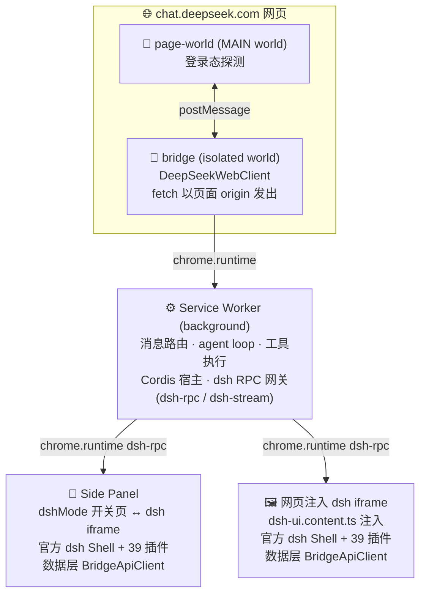

# dsh-in-web

> **dsh (DeepSeek Harness) inside your browser** · 无需本地安装 · No local install, no extra quota.

把 [chat.deepseek.com](https://chat.deepseek.com) 网页版改造成 **dsh（DeepSeek Harness）** 形态的 **Chrome MV3 浏览器扩展**。
Turn the [chat.deepseek.com](https://chat.deepseek.com) web app into a **dsh (DeepSeek Harness)**-shaped **Chrome MV3 extension**.


> [!NOTE]
> **核心卖点 / Core pitch**：完全无需本地安装 dsh。登录态、模型、对话全部复用网页版免费额度，扩展只负责两件事：把官方 dsh 前端完整嵌入，数据层走网页 bridge。
> No local dsh install at all. Session, models and conversations reuse the free web quota. The extension only does two things: embeds the official dsh frontend and routes the data layer through the page bridge.

## 🚀 特性 Features

- ✅ **嵌入式官方 dsh 前端 / Official dsh frontend embedded**
  完整移植 dsh Shell + 39 个 client 插件（会话 / 工作区 / 技能 / 提示词 / 模型 / 设置……），零修改官方产物，仅在同步时做最小 CSP 兼容 patch。
  Ships the full dsh Shell plus all 39 client plugins untouched; only a minimal CSP-compat patch is applied at sync time.

- 🎚️ **dsh 模式开关 / One-switch harness mode**
  Side Panel 永远是设置 / 开关页。打开开关，chat.deepseek.com 对话界面立即切换为全屏 dsh harness 形态；关闭即恢复普通对话，实时生效无需刷新。
  The Side Panel is always a settings page. Flip the switch and the chat UI morphs into a fullscreen dsh harness instantly, no refresh needed.

- 🔌 **bridge 传输层 / Bridge transport**
  自定义 `dsh-client-connection` bundle 替换官方 HTTP/WebSocket 连接层，RPC 经 `chrome.runtime` 转发到扩展后台，数据走 chat.deepseek.com 网页会话。
  A custom `dsh-client-connection` bundle replaces the stock HTTP/WebSocket layer; RPC hops through `chrome.runtime` to the extension background.

- 🌐 **网页版数据通道 / Web-page data channel**
  LLM 网络层放在 content script（isolated world）：fetch 以页面 origin 发出，Origin / Cookie 天然正确，服务端不拒绝。
  The LLM network layer lives in a content script (isolated world) so fetches carry the page origin; Origin and cookies come out naturally correct.

- 🧠 **原生功能保留 / Native harness features**
  流式聊天（thinking / text 分开展示）、虚拟工作区、skill 库、提示词管理、终端 MVP、Cordis 插件内核。
  Streaming chat (thinking and text rendered separately), virtual workspace, skill library, prompt manager, terminal MVP, Cordis plugin kernel.

## 🏗️ 架构 Architecture

> [!TIP]
> 一句话看懂：网页的登录态 + 扩展的 dsh 前端 + content script 的网络层，三条线在 Service Worker 汇合。
> In one line: the page's session, the extension's dsh frontend and a content-script network layer all meet at the Service Worker.



**关键设计决策 / Key design decisions**

- 🧱 **LLM 网络层放在 content script 而非 SW**
  扩展 SW 的 fetch 无法伪造 `Origin / Referer`（浏览器 forbidden headers），服务端会拒绝；content script 的 fetch 自动以页面 origin 发出，天然正确。
  **EN**: A service worker fetch can't spoof `Origin` / `Referer` (browser forbidden headers), so the server rejects it. Fetching from the content script automatically uses the page origin.

- 🛡️ **CSP：顶层 `new Function` → stub**
  MV3 扩展页 CSP 禁止 `unsafe-eval`，官方 index bundle 模块顶层就有 `new Function`（Cordis jsExpr 求值器），加载即崩。`scripts/patch-dsh-web.mjs` 把它替换为安全 stub；已确认全部插件 bundle 均不含 `__jsExpr`，零功能损失。
  **EN**: MV3 extension pages forbid `unsafe-eval`, but the official index bundle has a top-level `new Function` (the Cordis jsExpr evaluator), which crashes on load. `scripts/patch-dsh-web.mjs` swaps it for a safe stub; every plugin bundle is verified free of `__jsExpr`, so nothing is lost.

- 🔀 **连接层：BridgeApiClient 替换**
  官方 `dsh-client-connection` 走 HTTP/WebSocket 连本地 harness，浏览器里不存在该服务。`scripts/dsh-bridge/` 的 BridgeApiClient 接管：`doFetch` → `chrome.runtime.sendMessage({ kind: 'dsh-rpc' })`，流 → `chrome.runtime.connect({ name: 'dsh-stream' })`，后台网关转发到网页 bridge。
  **EN**: The stock connection layer targets a local harness over HTTP/WebSocket, a service that doesn't exist in a browser. BridgeApiClient from `scripts/dsh-bridge/` takes over: `doFetch` becomes `chrome.runtime.sendMessage({ kind: 'dsh-rpc' })`, streams become `chrome.runtime.connect({ name: 'dsh-stream' })`, and the background gateway forwards to the page bridge.

## 🛠️ 开发 Development

```bash
pnpm install          # 安装依赖（F: 盘 exFAT 需 node-linker=hoisted）/ install deps
pnpm dev              # WXT 开发模式（热重载）/ dev mode with HMR
pnpm build            # 构建产物 → .output/chrome-mv3 / build to .output/chrome-mv3
pnpm test             # vitest 全量测试 / run all vitest tests
pnpm compile          # tsc --noEmit 类型检查 / type-check
pnpm check            # compile + test + build 一站式 / compile + test + build
```

### 同步 dsh 官方前端（可选）/ Sync the official dsh frontend (optional)

`public/dsh-web/` 由本地 deepseek-harness checkout 同步生成，不入库。Generated from a local deepseek-harness checkout; not committed to the repo.

```bash
node scripts/import-dsh.mjs                # 同步官方 dist + 39 个 client 插件 + 生成 boot-manifest
node scripts/patch-dsh-web.mjs             # 自动应用 CSP 兼容 patch（import-dsh 内部也会调用）
node scripts/build-connection-bridge.mjs   # 重新构建自定义 connection bridge bundle
```

### 手动加载 / Manual load

1. `pnpm build`
2. Chrome → `chrome://extensions` → 开发者模式 → 加载已解压的扩展程序 → 选择 `.output/chrome-mv3`
3. 打开 chat.deepseek.com 并登录 / Open chat.deepseek.com and sign in
4. 点击扩展图标 / `Ctrl+Shift+Y` 打开侧边栏 / Click the extension icon or press `Ctrl+Shift+Y`
5. 在设置页打开 **dsh 模式** → 对话界面切换为 dsh harness 形态 / Turn on **dsh mode** and the chat UI switches to the harness

### 调试 / Debugging

白屏 / 插件加载失败排查：打开 `chrome-extension://<扩展ID>/debug.html`，页面会直接渲染诊断结果（CSP 探测 / 资源可达性 / boot 复现），无需开 devtools。
**EN**: For a white screen or plugin load failures, open `chrome-extension://<extension-id>/debug.html`. The page renders diagnostics directly (CSP probe / resource reachability / boot replay). No devtools needed.

## ✅ 测试覆盖 Test Coverage

| 模块 Module | 文件 File | 覆盖点 Coverage |
|---|---|---|
| bridge | `tests/bridge/*` | PoW 解算 / SSE 解析 / 协议构造 / client 流式 + 重试 |
| fs | `tests/fs/workspace.spec.ts` | 虚拟工作区读写编辑、沙箱模式、路径防穿越 |
| skills | `tests/skills/skill.spec.ts` | SKILL.md 解析 / 目录渲染 / /name 匹配 |
| prompts | `tests/prompts/prompt.spec.ts` | 分节 / 插值 / persona |
| agent | `tests/agent/*` | 工具调用解析 / agent loop 多轮回填 / 工具注册表 |
| plugin | `tests/plugin/*` | Cordis 内核 / 浏览器宿主服务 / L0 加载器 |
| settings | `tests/settings/settings.spec.ts` | 设置持久化 / 归一化 |
| ui | `tests/ui/filetree.spec.ts` | 文件树构建与过滤 |
| terminal | `tests/terminal/shell.spec.ts` | 白名单命令 / 注入拒绝 / 引号解析 |

## 🗺️ 里程碑 Milestones

- **Wave 0** 骨架 + 四件套 + 基线验证 ✅
- **Wave 1** 协议层 + bridge runtime + 聊天 UI ✅
- **Wave 2** 虚拟 FS / skill 库 / 提示词 / agent 原语 ✅
- **Wave 3** Cordis 内核 / 浏览器宿主 / 插件加载器 / L1 设计 ✅
- **Wave 4** agent loop / Side Panel 标签页 / 终端 MVP ✅
- **Wave 5** 工程化（README / 收尾自检）🔄
- **嵌入 dsh** 官方前端嵌入 + bridge 传输层 + CSP patch + 开关切换 🔄

## 📂 目录 Structure

```
entrypoints/
  background.ts            # SW：路由 / agent loop / Cordis 宿主 / dsh RPC 网关
  bridge.content.ts        # isolated world：LLM 网络层 + 消息桥
  page-world.content.ts    # MAIN world：登录态探测
  dsh-ui.content.ts        # 页面内嵌 dsh iframe 注入器（dshMode 驱动）
  sidepanel/               # main.tsx(开关页↔dsh iframe) / App.tsx / TerminalView.tsx / style.css
scripts/
  import-dsh.mjs           # 同步 dsh 官方前端产物 → public/dsh-web/
  patch-dsh-web.mjs        # CSP 兼容 patch（顶层 new Function → stub）
  build-connection-bridge.mjs  # 构建自定义 connection bridge bundle
  dsh-bridge/              # BridgeApiClient / bridge-rpc / connection-entry（连接层替换）
public/
  debug.html / debug.js    # 白屏诊断页
utils/
  bridge/                  # 协议层（client / protocol / pow / sse-parser）
  fs/workspace.ts          # 虚拟工作区（IndexedDB + 沙箱模式）
  skills/skill.ts          # skill 库 L0
  prompts/prompt.ts        # 提示词管理
  agent/                   # agent loop / 工具注册表 / 原语
  plugin/                  # Cordis 宿主 / 加载器 / 设计
  settings/settings.ts     # DshSettings 持久化（chrome.storage.local）
  ui/filetree.ts           # 文件树视图模型
  terminal/shell.ts        # 白名单 shell simulator
  messages.ts              # 全链路消息协议
tests/                     # 17 个 spec 文件
```

## 🙏 鸣谢 Acknowledgements

- 🤖 **DeepSeek**：感谢 DeepSeek 团队及其开源项目 **dsh（DeepSeek Harness）**。本项目嵌入的官方前端（`public/dsh-web/`）来自 [deepseek-ai/DeepSeek-Harness](https://github.com/deepseek-ai/DeepSeek-Harness)，遵循 MIT 协议，完整版权声明见 [LICENSE](./LICENSE)。
  **EN**: Thanks to the DeepSeek team and the open-source **dsh (DeepSeek Harness)** project. The embedded official frontend (`public/dsh-web/`) comes from [deepseek-ai/DeepSeek-Harness](https://github.com/deepseek-ai/DeepSeek-Harness) under the MIT license; the full copyright notice is in [LICENSE](./LICENSE).
- 🧡 **oneinitAI**：本项目的工程实现与持续维护。
  **EN**: Engineering and ongoing maintenance of this project.

## 📄 许可 License

[MIT](./LICENSE)，保留 DeepSeek（dsh 原作者）与本项目作者版权声明。
**EN**: MIT, keeping the copyright notices of DeepSeek (the original dsh author) and this project's author.
